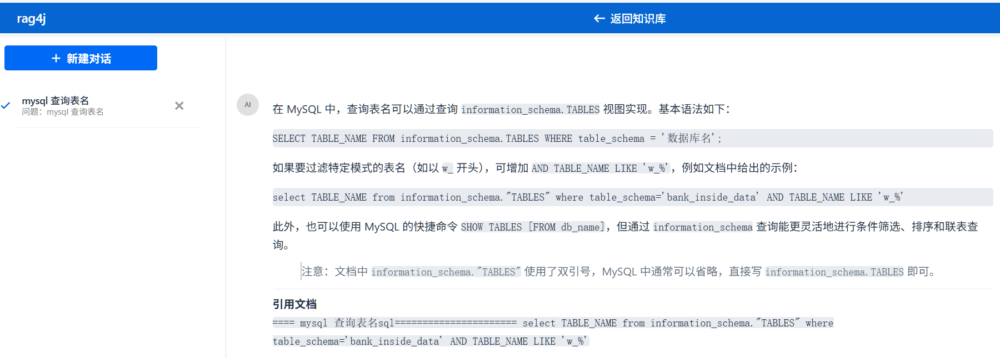
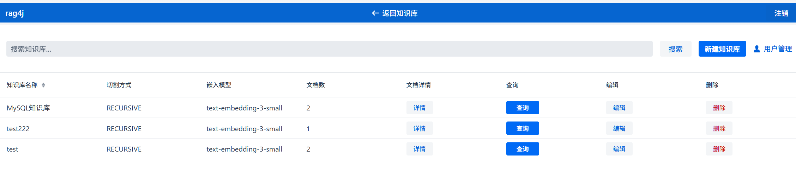
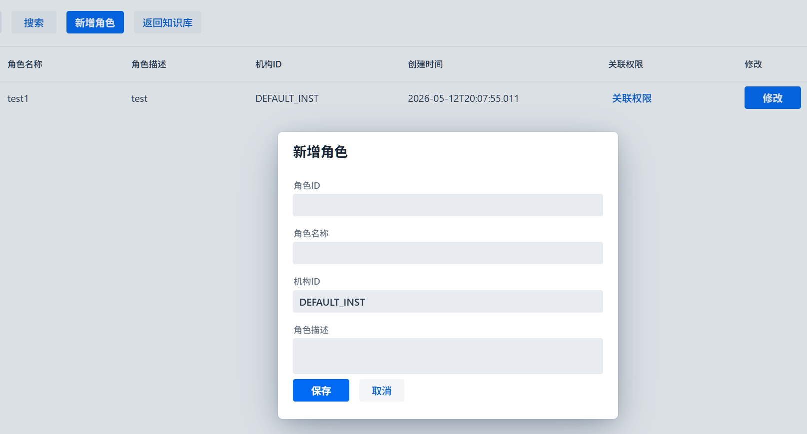
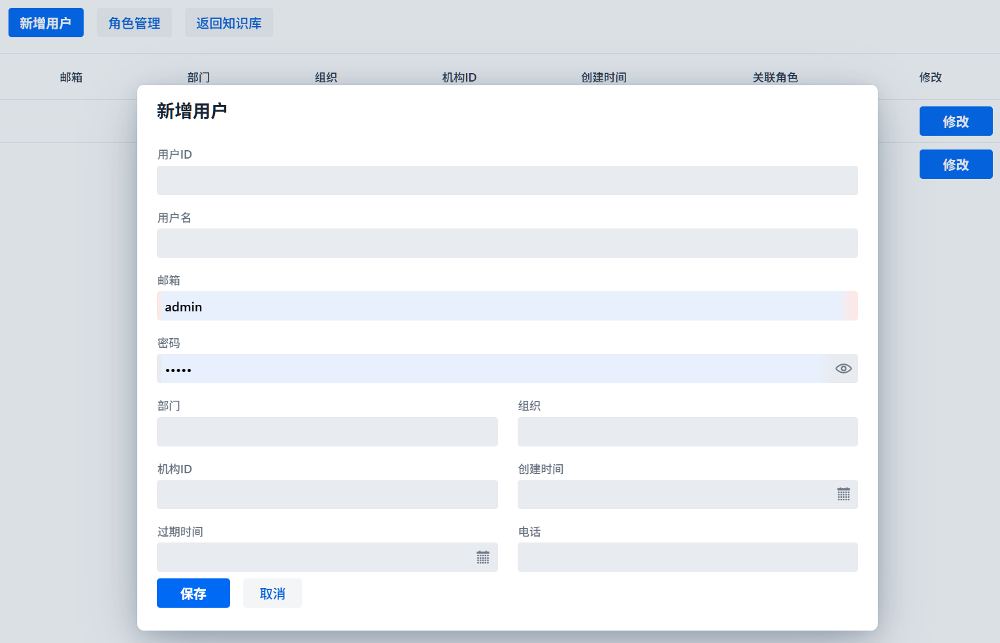

# rag4j
**rag4j** is a Java 21 Spring Boot 3.5.0 RAG (Retrieval-Augmented Generation) application built with Maven and the LangChain4j ecosystem.
It is designed as an AI-powered document processing and retrieval system.


### Tech Stack

- **Spring Boot** 4.0.6 with WebFlux (reactive web layer)
- **vaadin** 24.8.3
- **LangChain4j** 1.11.0: Spring integration, OpenAI-compatible models, agentic AI, Easy RAG, Milvus vector DB, MCP support
- **Document parsers**: PDFBox, Apache POI, Apache Tika, Markdown
- **Database**: SQLite (`./rag4j.db`)
- **LLM**: `qwen3.5-flash` via , `text-embedding-3-small` for embeddings

## Commands

```bash
# Build
./mvnw clean package

# Run the application
./mvnw spring-boot:run

# Run tests
./mvnw test

# Run a single test class
./mvnw test -Dtest=Rag4jApplicationTests

# Package as executable JAR
./mvnw package
```

## Architecture

```
src/main/java/com/sl/rag4j/
├── Rag4jApplication.java          # Main entry point (@SpringBootApplication)
com.sl.rag4j.config 包存放一些配置的bean，比如数据库配置，模型的bean等
com.sl.rag4j.entity 存放和数据库对应的实体映射类
com.sl.rag4j.mapper 存放mybatis 对应的mapper接口
com.sl.rag4j.ragservice 存放rag使用的一些核心业务类，比如如何解析用户的文本内容、如何嵌入及相关业务实现类
com.sl.rag4j.ui.view 存放使用vaadin24实现的用户界面
com.sl.rag4j.ui.component 存放vaadin界面依赖的一些公共模板组件
com.sl.rag4j.tool 存放model可以调用的工具
com.sl.rag4j.model 存放langchain4j的模型接口类
com.sl.rag4j.controller 存放对外调用的接口

src/main/resources/
├── application.yaml               # All configuration: server, datasource, langchain4j, OpenAI
```
写好的代码记得每个方法都要增加注释，方便后续维护，方法中如果有复杂逻辑也要注释说明
### Configuration (`application.yaml`)

- Server runs on port `8080`
- SQLite datasource: `jdbc:sqlite:./rag4j.db` with Hibernate DDL auto set to `update`
- LLM chat model: `qwen3.5-flash` (temperature 0.7, via `https://api.dmxapi.cn/v1`)
- Streaming chat model: temperature 0.5
- Embedding model: `text-embedding-3-small`
- API key from `OPENAI_API_KEY` environment variable
- 向量数据库使用milvus

### Key Dependencies to Know

- `langchain4j-spring-boot-starter` — core Spring integration
-  `vaadin`- user interface
- `langchain4j-open-ai-spring-boot-starter` — OpenAI-compatible API client (works with any compatible endpoint)
- `langchain4j-reactor` — WebFlux/reactive streaming support
- `langchain4j-agentic` — agentic AI capabilities
- `langchain4j-easy-rag` — simplified RAG pipeline setup
- `langchain4j-milvus` — Milvus vector database integration
- `langchain4j-mcp` — Model Context Protocol support
- Document loaders: `langchain4j-document-parser-apache-pdfbox`, `langchain4j-document-parser-apache-poi`, `langchain4j-document-loader-tika`, `langchain4j-document-parser-markdown`

### screenshots







